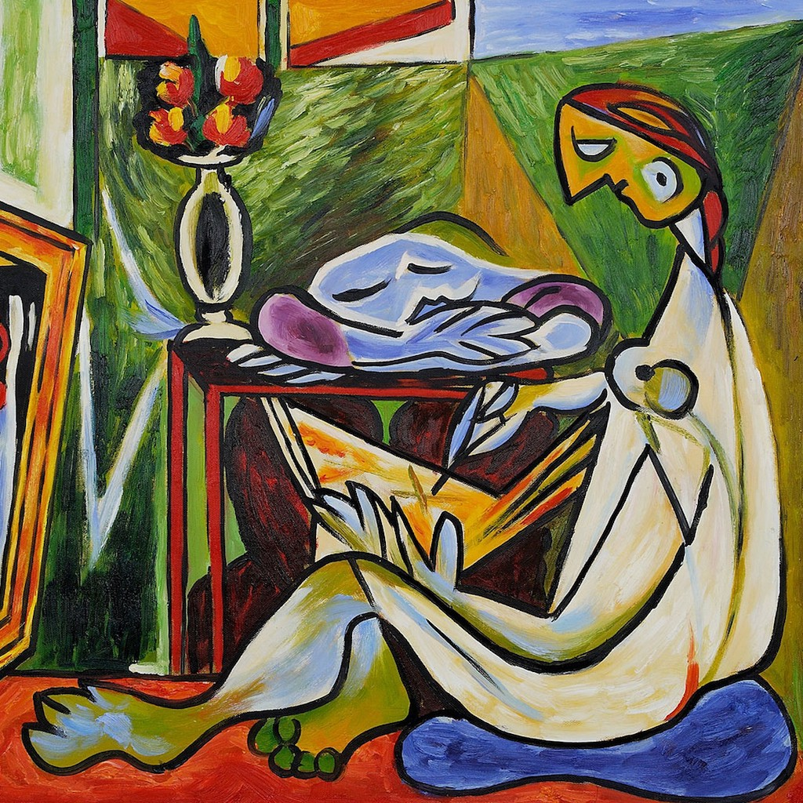
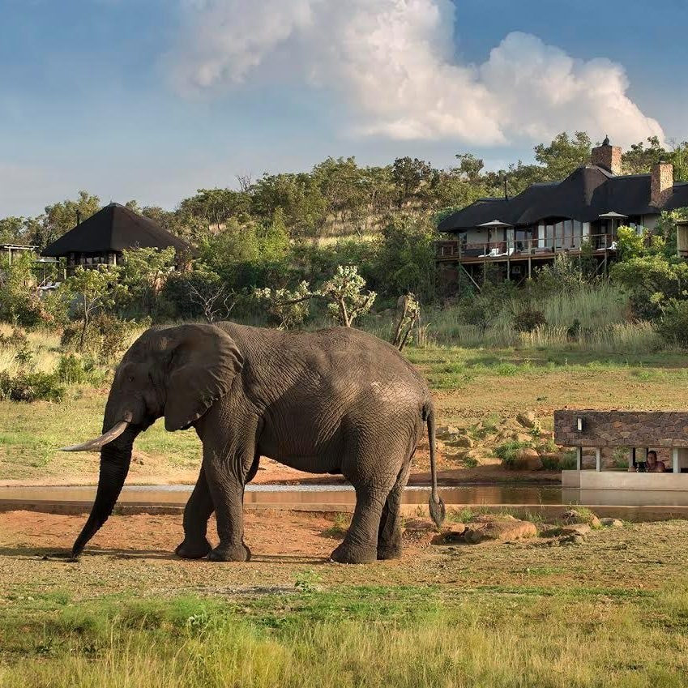
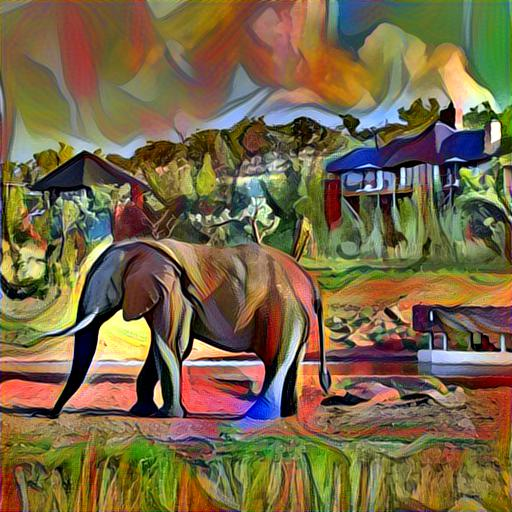

## Image Style transfer
Add styles from a reference image to an output style image.

 + ! = 

### Requirements
You will need the following to run the above:
- TensorFlow > 2.0
- Python 3.8.2, scipy 0.18.1, numpy 1.11.2
- (A good gpu helps )

### Citation
- Part of the deep learning with convolutional neural networks lab on [DataCamp](https://www.datacamp.com/courses/convolutional-neural-networks-for-image-processing?tap_a=5644-dce66f&tap_s=357540-5b28dd)
```
  @inproceedings{johnson2016perceptual,
    title={Perceptual losses for real-time style transfer and super-resolution},
    author={Johnson, Justin and Alahi, Alexandre and Fei-Fei, Li},
    booktitle={European conference on computer vision},
    pages={694--711},
    year={2016},
    organization={Springer}
  }
```
